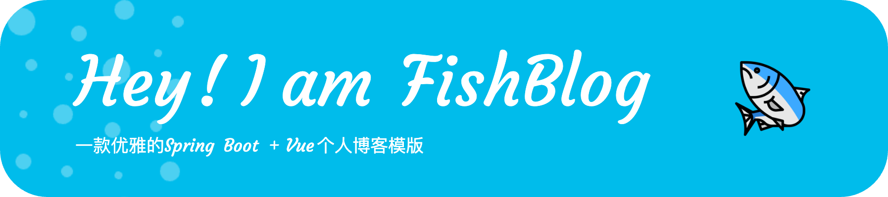
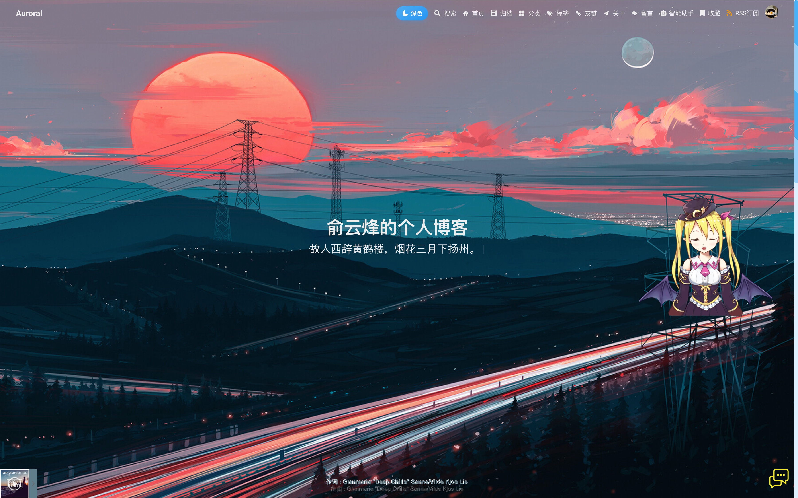
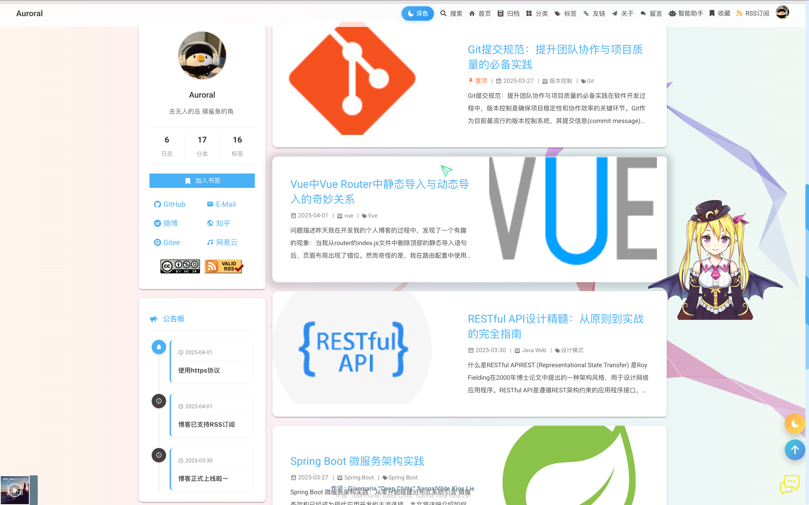
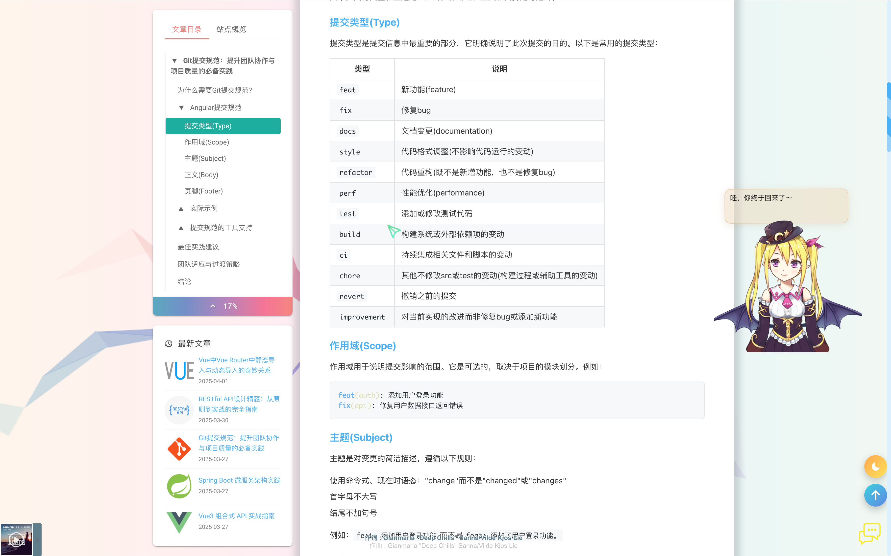

<div align="center">
  
</div>


<div align="center">

[](https://github.com/your-username/fishblog)

<p align="center">
  <a href="LICENSE">
    
  </a>
  <a href="https://vuejs.org/">
    
  </a>
  <a href="https://spring.io/projects/spring-boot">
    
  </a>
  <a href="https://redis.io/">
    
  </a>
</p>

<p align="center">
  <a href="https://www.elastic.co/">
    
  </a>
  <a href="https://www.rabbitmq.com/">
    
  </a>
  <a href="https://developer.mozilla.org/en-US/docs/Web/API/WebSockets_API">
    
  </a>
</p>

<p align="center">
  <a href="https://github.com/your-username/fishblog/pulls">
    
  </a>
  <a href="https://github.com/your-username/fishblog/stargazers">
    
  </a>
  <a href="https://github.com/your-username/fishblog/network/members">
    
  </a>
</p>

</div>

## ✨ 项目简介

**[FishBlog（点击跳转到博客演示地址）](https://fishblog.yyf040810.cn)** 是一款基于 Spring Boot + Vue.js 的前后端分离博客系统模板，设计优雅、功能齐全。采用 ByteMD 编辑器提供流畅的写作体验，支持 RSS 订阅、邮件提醒、实时聊天室、多种社交平台登录、友情链接管理、看板娘、音乐播放器、自定义鼠标样式等丰富功能。您可以在此基础上进行任意 DIY 定制，快速打造专属于您的个性化博客空间，展示您的创意和知识。

> 💡 完全开源、简单易用、美观大方，随机diy， 让您的博客与众不同！

## 📸 效果展示

<div align="center">
  <table>
    <tr>
      <td>
        
        <p align="center">首页 - 精美布局展示最新文章和热门内容</p>
      </td>
      <td>
        
        <p align="center">文章列表 - 分页展示所有博客文章</p>
      </td>
    </tr>
    <tr>
      <td>
        
        <p align="center">文章详情 - 支持Markdown渲染和代码高亮</p>
      </td>
      <td>
        
        <p align="center">归档页面 - 按时间线展示所有文章</p>
      </td>
    </tr>
    <tr>
      <td>
        
        <p align="center">标签页面 - 可视化展示文章标签分布</p>
      </td>
      <td>
        
        <p align="center">分类页面 - 清晰整理不同类别的文章</p>
      </td>
    </tr>
    <tr>
      <td>
        
        <p align="center">留言板 - 支持Emoji表情和回复功能</p>
      </td>
      <td>
        
        <p align="center">友链页面 - 展示和管理友情链接</p>
      </td>
    </tr>
  </table>
</div>

## 🔨 技术栈

<div align="center">
<table>
  <tr>
    <td>
      <strong>🖥️ 后端</strong>
    </td>
    <td>
      <strong>🎨 前端</strong>
    </td>
    <td>
      <strong>🔧 其他</strong>
    </td>
  </tr>
  <tr>
    <td>
      <ul>
        <li>Spring Boot</li>
        <li>Spring Security</li>
        <li>Spring Data JPA</li>
        <li>MyBatis Plus</li>
        <li>MySQL</li>
        <li>Redis</li>
        <li>RabbitMQ</li>
        <li>Elasticsearch</li>
        <li>Swagger2</li>
        <li>Nginx</li>
        <li>Docker</li>
        <li>MaxWell</li>
        <li>WebSocket</li>
      </ul>
    </td>
    <td>
      <ul>
        <li>Vue.js</li>
        <li>Element UI</li>
        <li>Bytemd</li>
        <li>Vuetify</li>
        <li>Axios</li>
        <li>Vuex</li>
        <li>Vue Router</li>
        <li>ECharts</li>
      </ul>
    </td>
    <td>
      <ul>
        <li>QQ第三方登录</li>
        <li>微博第三方登录</li>
        <li>GitHub第三方登录</li>
        <li>腾讯云人机验证</li>
        <li>微信人机验证</li>
        <li>WebSocket即时通讯</li>
        <li>阿里云OSS对象存储</li>
        <li>Ribbon.js动态背景</li>
        <li>Live2D看板娘</li>
        <li>APlayer音乐播放器</li>
      </ul>
    </td>
  </tr>
</table>
</div>

## 🎯 功能特性

<div align="center">
  <table>
    <tr>
      <td>🎨 美观的响应式界面设计</td>
      <td>📝 ByteMD文章编辑器</td>
      <td>🔍 Elasticsearch全站搜索</td>
    </tr>
    <tr>
      <td>🖼️ 文章封面图上传</td>
      <td>🏷️ 标签、分类管理</td>
      <td>📊 ECharts数据可视化</td>
    </tr>
    <tr>
      <td>🔐 RBAC角色权限管理</td>
      <td>💬 评论邮件提醒功能</td>
      <td>🔑 多种第三方登录方式</td>
    </tr>
    <tr>
      <td>📱 移动端适配设计</td>
      <td>📡 RSS订阅功能</td>
      <td>💥 点击特效与鼠标样式</td>
    </tr>
    <tr>
      <td>🎵 音乐播放器集成</td>
      <td>💕 Live2D看板娘</td>
      <td>💬 实时聊天室功能</td>
    </tr>
    <tr>
      <td>🔗 友情链接管理</td>
      <td>🌙 深色模式支持</td>
      <td>📜 平滑目录跳转功能</td>
    </tr>
  </table>
</div>

## 🏗️ 项目结构

```
FishBlog
├── blog-springboot    // 🖥️ 博客后端 (Spring Boot)
├── blog-vue           // 🎨 博客前端
│   ├── admin          // ⚙️ 后台管理系统 (Vue.js + Element UI)
│   └── blog           // 🌐 前台展示页面 (Vue.js)
└── blog-mysql8.sql    // 📦 数据库文件
```

## 🛠️ 开发环境

### 开发工具

<div align="center">
  <table>
    <tr>
      <th>开发工具</th>
      <th>说明</th>
    </tr>
    <tr>
      <td>IDEA</td>
      <td>Java开发工具IDE</td>
    </tr>
    <tr>
      <td>VSCode</td>
      <td>Vue开发工具IDE</td>
    </tr>
    <tr>
      <td>Navicat</td>
      <td>MySQL远程连接工具</td>
    </tr>
    <tr>
      <td>Another Redis Desktop Manager</td>
      <td>Redis远程连接工具</td>
    </tr>
    <tr>
      <td>Termius</td>
      <td>Linux远程连接工具</td>
    </tr>
    <tr>
      <td>filezilla</td>
      <td>Linux文件上传工具</td>
    </tr>
    <tr>
      <td>Postman</td>
      <td>API接口测试工具</td>
    </tr>
    <tr>
      <td>Jmeter</td>
      <td>性能测试工具</td>
    </tr>
    <tr>
      <td>Typora</td>
      <td>Markdown编辑器</td>
    </tr>
    <tr>
      <td>Docker</td>
      <td>容器化部署工具</td>
    </tr>
  </table>
</div>

### 环境版本

- **JDK**: 1.8
- **MySQL**: 8.0.20
- **Redis**: 6.0.5
- **Elasticsearch**: 7.9.2
- **RabbitMQ**: 3.8.5

## 🚀 快速开始

### 1️⃣ 数据库配置

<details>
<summary>展开查看详情</summary>

1. 导入数据库文件: `blog-mysql8.sql`
2. 博主用户信息ID默认为1，如需修改请到 /constant/UserConst 处修改BLOGGER_ID

</details>

### 2️⃣ 后端配置

<details>
<summary>展开查看详情</summary>

1. 进入`blog-springboot`目录
2. 编辑`src/main/resources/application-dev.yml`文件，配置以下信息:
   - 数据库连接信息
   - Redis连接信息
   - RabbitMQ连接信息
   - 邮箱配置
   - 第三方登录配置(QQ、微博、GitHub、微信、短信等)
   - 阿里云OSS配置
   - Elasticsearch配置(需要自己先创建索引)

示例:
```yaml
spring:
  datasource:
    url: jdbc:mysql://localhost:3306/blog?serverTimezone=GMT%2B8&allowMultiQueries=true
    username: your_username
    password: your_password
    
  redis:
    host: localhost
    port: 6379
    password: your_redis_password
    
  rabbitmq:
    host: localhost
    port: 5672
    username: guest
    password: guest
```

3. 运行Spring Boot应用:
```bash
mvn spring-boot:run
```

</details>

### 3️⃣ 前端配置

<details>
<summary>展开查看详情</summary>

#### 🔧 后台管理系统

1. 进入`blog-vue/admin`目录
2. 安装依赖:
```bash
npm install
```
3. 在`src/config/config.js`中配置各类API:
   - 腾讯验证码应用ID
   - 第三方登录API配置(QQ、微博、Github)
   - 微信公众平台API
   - 短信服务API
4. 运行开发服务器:
```bash
npm run serve
```
5. 打包生产环境:
```bash
npm run build
```

#### 🌐 前台页面

1. 进入`blog-vue/blog`目录
2. 安装依赖:
```bash
npm install
```
3. 运行开发服务器:
```bash
npm run serve
```
4. 打包生产环境:
```bash
npm run build
```

#### 📡 第三方服务申请与配置

在全面使用本系统前，您需要申请并配置以下第三方服务:

1. **社交平台登录**
   - QQ互联: 在[QQ互联平台](https://connect.qq.com/)申请应用并获取AppID和AppKey
   - 微博开放平台: 在[微博开放平台](https://open.weibo.com/)创建应用
   - GitHub OAuth: 在[GitHub开发者设置](https://github.com/settings/developers)创建OAuth应用

2. **消息通知服务**
   - 邮箱服务: 配置SMTP服务器信息(推荐163邮箱或企业邮箱)
   - 短信服务: 申请阿里云或腾讯云短信服务
   - 微信公众平台: 申请公众号并获取相关API密钥

3. **中间件配置**
   - Redis: 配置正确的端口号(默认6379)和密码
   - RabbitMQ: 设置连接信息、队列和交换机(默认端口5672)
   - Elasticsearch: 配置集群地址和端口号(默认9200)

> ⚠️ **重要提示:** 各第三方服务的具体申请流程和配置方法请参考各平台的官方文档，申请过程可能随平台政策变化而调整。所有API密钥请妥善保管，避免泄露。
</details>

## 👤 默认账户

<div align="center">

| 用户名 | 密码 |
|:------:|:------:|
| admin@163.com | 123456 |

</div>

> ⚠️ **安全提示:** 请在部署后立即修改默认密码！

## ⚠️ 注意事项

- ✅ 请确保您已修改所有默认密码和API密钥
- ✅ 生产环境部署时请使用`application-prod.yml`配置文件
- ✅ 建议启用HTTPS以保护您的数据
- ✅ 定期备份您的数据库

## 🔧 自定义

您可以根据自己的需求对模板进行自定义，包括但不限于:

- 🎨 修改页面主题和样式
- ➕ 添加新的功能模块
- 🔌 集成其他第三方服务
- ⚡ 优化性能和安全性

## 🤝 贡献指南

### Fork & DIY

欢迎 Fork 本项目来创建和定制您自己的个人博客！步骤如下：

1. 点击右上角的 "Fork" 按钮
2. 克隆您 Fork 的仓库到本地
3. 按照 [快速开始](#-快速开始) 部署您的博客
4. 根据您的需求进行个性化定制
5. 提交并推送您的更改到您的仓库

> ⚠️ **重要提醒：** 在部署和提交代码前，请确保删除所有个人敏感信息，包括但不限于：邮箱地址、密码、API密钥、个人照片等。

### 提交 Pull Request

我们非常欢迎您为 FishBlog 做出贡献！如果您有任何改进或新功能，请按以下步骤提交 PR：

1. Fork 本仓库
2. 创建您的特性分支 (`git checkout -b feature/amazing-feature`)
3. 提交您的更改 (`git commit -m '添加了一些很棒的特性'`)
4. 推送到分支 (`git push origin feature/amazing-feature`)
5. 打开一个 Pull Request

#### PR 规范

为了让维护者更好地理解您的贡献，请在 PR 标题和描述中包含以下信息：

- 使用前缀：`[修复]`、`[功能]`、`[优化]`、`[文档]` 等
- 简洁明了地描述您所做的更改
- 提供更改的原因或背景（如适用）

**示例**：
- `[修复] 修复移动端评论列表显示不正确的问题`
- `[功能] 添加暗黑模式主题切换功能`
- `[优化] 提升文章加载性能`

## 📝 Todo 列表

以下是我们计划添加的功能：

- [ ] Markdown 编辑器主题切换
- [ ] 更多 UI 风格和主题美化
- [ ] 用户数据绑定（多平台账号关联）
- [ ] 评论回复邮件通知功能
- [ ] 更多的第三方登录集成
- [ ] 国际化支持

欢迎贡献代码实现上述功能！

## 🙏 致谢

特别感谢 [coder-fang/thatblog](https://github.com/coder-fang/thatblog) 项目提供的优秀博客模板参考。该项目为本项目的开发提供了宝贵的灵感和技术参考。

## 📜 许可证

本项目使用Apache-2.0许可证 - 详见[LICENSE](LICENSE)文件

---

<div align="center">
  <sub>Built with ❤️ by Yunfeng Yu</sub>
</div>